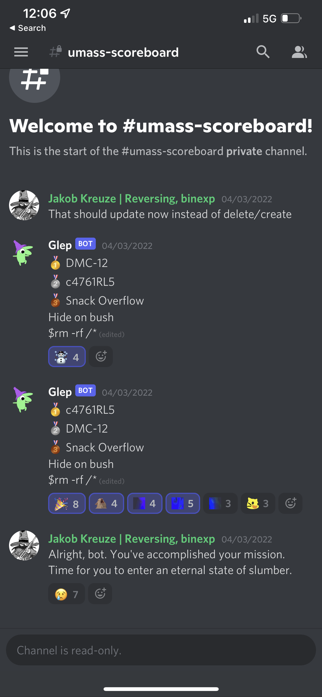

# UMass CTF 2022

4/3 - 4/5, 2022

- UMassCTF '22 Challenges are released
  at [UMassCybersecurity/UMassCTF-2022-challenges](https://github.com/UMassCybersecurity/UMassCTF-2022-challenges)
- CTF archived at [CTF TIME Event](https://ctftime.org/event/1561)
- Website: [https://ctf.umasscybersec.org/](https://ctf.umasscybersec.org/)
- Team's page: [https://ctf.umasscybersec.org/teams/372](https://ctf.umasscybersec.org/teams/372)

## Solved challenges

- [pwn/zip_parser](pwn/zip_parser) (500)
- [misc/tino](misc/tino) (489)
- [misc/python_ijele](misc/python_ijele) (427)
- [misc/quickmaths](misc/quickmaths) (248)
- misc/discord (50)

Solved after the competition

- [misc/jeopardyV1](misc/jeopardyV2)
    - 5 min after the competition ends. We would be the 3rd place on UMass
      scoreboard with literally 5 more min.
- [crypto/hatmash](crypto/hatmash)

## Writeups

- [pwn/zip_parser](pwn/zip_parser/README.md)
- [crypto/hatmash](crypto/hatmash/README.md)

## Team: **Hide on bush**

- [garywei944](https://github.com/garywei944)
- [Yur1clone](https://github.com/Yur1clone)
- [yicao928](https://github.com/yicao928)

We ranked ***37 / 314*** on the overall scoreboard, the ***4th place*** on
UMass scoreboard.

## Directory layout for challenges

- `src`: source code and server setup
- `static`: challenge files released to competitors during CTF
- `archived`: output / temp files I generated during competition
- `workspace`: demos / trial & error
- `images`: images for writeup
- `README.md`: writeup

The solution is put directly under each challenge directory and should be ready
to go.

## UMass scoreboard

