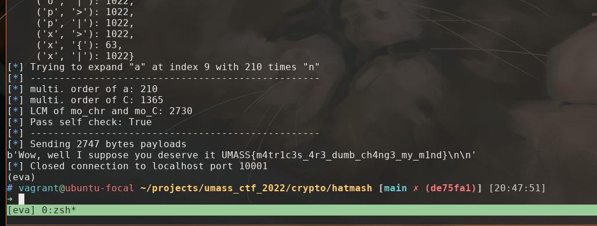

# hatmash

## Challenge

> What do you mean "We think you spend too much time with matrices."? It's just a hash function, jeez...



## Explore and Analysis

[`hatmash.py`](hatmash.py) is the only file released to the competitors. After
read through the functions and some verification, we can easily tell it's all
about matrix operations defined
on [logical matrices](https://en.wikipedia.org/wiki/Logical_matrix), or 0-1
matrix in some context. Our goal is to find a collision.

To begin with, we read through the helper functions.

```python
def bytes_to_mat(x):
    assert len(x) == 32
    bits = list('{:0256b}'.format(int.from_bytes(x, 'big')))
    return [[int(j) for j in bits[i:i + 16]] for i in range(0, 256, 16)]


def mat_to_bytes(x):
    return int(''.join([str(i) for j in x for i in j]), 2).to_bytes(
        (len(x) * len(x[0]) + 7) // 8, 'big')


def mod_mult(a, b, m):
    assert len(a[0]) == len(b)
    return [[sum([a[k][i] * b[i][j] for i in range(len(b))]) % m for j in
             range(len(a))] for k in range(len(a))]


def mod_add(a, b, m):
    assert len(a[0]) == len(b[0]) and len(a) == len(b)
    return [[(a[i][j] + b[i][j]) % m for j in range(len(a[0]))] for i in
            range(len(a))]
```

- `bytes_to_mat()` converts the passed in bytes string to its binary
  representation in 256 bits and make a 16*16 logical matrix.
- `mat_to_bytes()` just reverse the above process
- `mod_mul(a, b, m)` is equivalent to the following numpy
  statement `return (a @ b) % m`, where `@` is the matrix multiplication
  operator.
- `mod_add(a, b, m)`, similarly, `return (a + b) % m`

```python
def mash(x):
    bits = list('{:0{n}b}'.format(int.from_bytes(x, 'big'), n=8 * len(x)))
    if bits.pop(0) == '0':
        ret = A
    else:
        ret = B
    for bit in bits:
        if bit == '0':
            ret = mod_mult(ret, A, 2)
        else:
            ret = mod_mult(ret, B, 2)
    lenC = C
    for _ in range(len(x)):
        lenC = mod_mult(lenC, C, 2)
    return mat_to_bytes(mod_add(ret, lenC, 2))
```

Except helper functions, `mash(x)` is the only interesting function here. A
bytes string with length n is converted to its binary representation, this
should be the passphrase we want to generate.

For each bit in its binary representation, based on the bit value, `A` or `B`
is matrix multiplied to the right. Then `C^(n+1)` is added to the result.
Equivalently,

```text
T = {A, B}^n + C^(n+1), where A, B, C, T are logical matrices
```

So our goal to the challenge is to find a passphrase other
than `gib m3 flag plox?` and make a
collision, `mash(passphrase) == mash(b'gib m3 flag plox?')`.

## Approach to the solution

The first thing I did was to write everything in numpy. numpy array is
implemented based on C/C++ and use multiprocessing for matrix multiplication
which greatly increase the runtime speed.

Then I implement a DFS and a random search algorithm to brute-force a
passphrase. Unfortunately, it's not that easy.

Then I try to work on the properties of random generalized square matrix and
logical matrix. I noticed that almost every random initialized 16*16 logical
matrix is invertible (with ~ `(16*15/2) / 2^16 ~= 0.35%` it's not). And
elementwise `A + B = A xor B`, `A * B = A & B` for A, B logical matrix. But
they didn't extend to matrix multiplication. I also thought of matrix
decomposition, but didn't make more progress in the end.

Finally, I turn in to multiplication order or logical matrices. That is for
logical matrix A, if `A^i = A`, then i-1 is the multiplicative order of A
defined for this group. If we can find one letter from the actual
passphrase `gib m3 flag plox?` whose matrix representation after `mash(c)` is
small, we expend it s.t. `ccccccccc...ccc` and `c` gives the same result after
the sequence of A and B multiplication, and somehow it doesn't change `C^(n-1)`
, we made a collision.

So my algorithm is

1. compute multi. order for all letters in `gib m3 flag plox?`, find the one
   with least mult. oder, donote it `c`, and denote its multi. order `m`.
2. compute multi. order for C, denoted `n`
3. calculate the least common multiple of `m` and `n`, `lcm(m, n)`
4. insert `lcm(m, n)` times `c` before its occurrence in the passphrase
5. restart the process if the multi. order of any necessary matrix is too large
   for a payload.

Implemented at [`solve.old.py`](solve.old.py).


## Shorter payload

numpy matrix multiplication is fast, so we don't care much in computing the
multi. order. But we don't want payload to be too large b/c `hatmash.py`
implemented naive matrix multiplication and that is thousands of times slower.

An improvement would be using `aaaaaaa...aaab` to expand `b` instead of
just `bbbbbbb...bbb`. This allows us to potentially use any character in the
ALP.

So we compute all possible combination to expand `t` with `cccc...ccct`, and
choose the one that has least `lcm(m, n)`.


