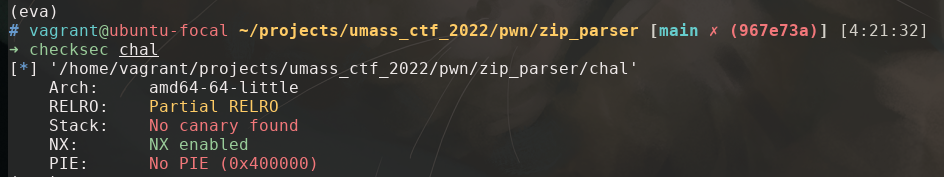
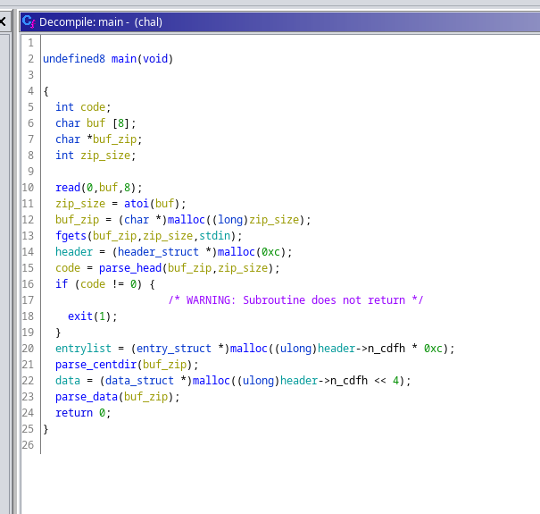
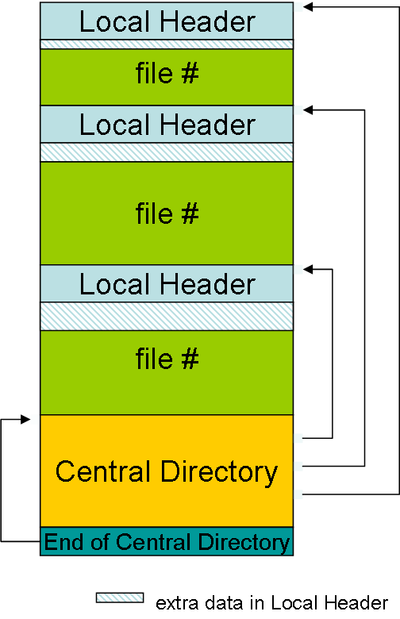
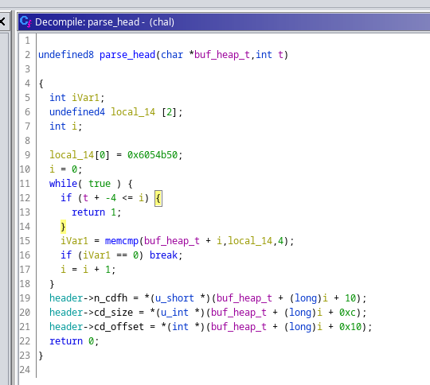
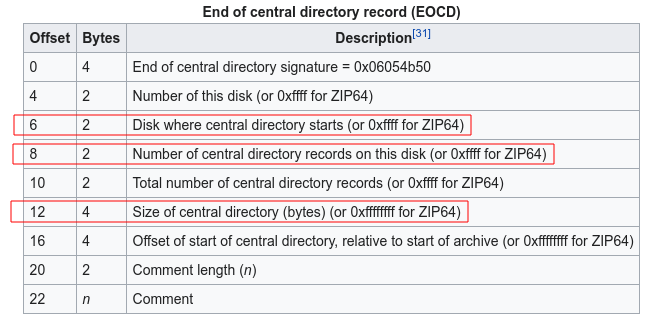
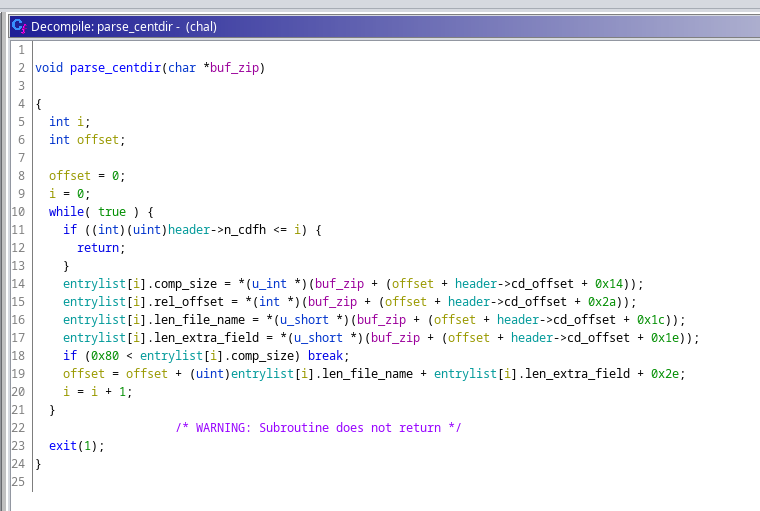
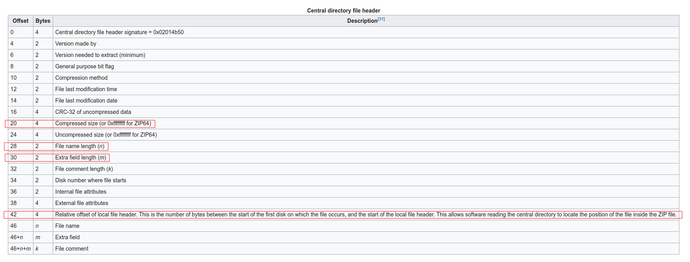
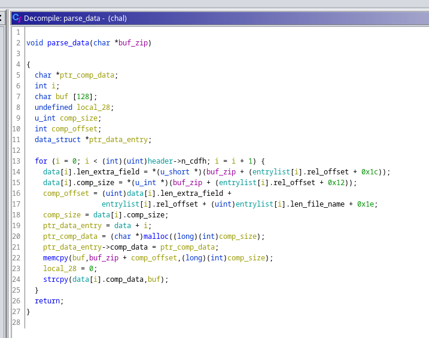
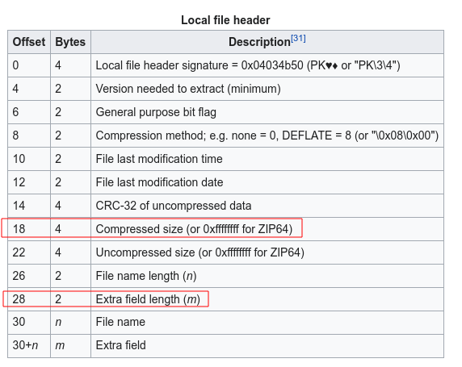

# zip_parser

ret2dlresolve on x86_64 with large gap between text and writable sections

by garywei944 on 4/4/2022

`zip_parser` is a pwn challenge on UMass CTF 2022. The binary mimics a real
world scenario of a zip parser that contains a buffer overflow vulnerability
due to lack of boundary check. What makes the challenge extremely hard and
non-trivial is that the binary doesn't have any output function loaded on the
GOT table, which makes it impossible to leak any memory before exploitation.

Also, yet the pwntools automation functions for doing ret2dlresolve works well
for this challenge, it doesn't work for 64-bit binaries with large gap between
text and writable sections. I used an approach of manually forging link_map
that deals with such issue.

In this writeup, I will go through the thought process from developing this
challenge and including a detailed explanation to my approach of ret2dlresolve.

## Static Analysis

To investigate the challenge binary, we can begin with some checksec and
reverse engineering.

### checksec



### Reversing

Loading up the binary in Ghidra gives us a pretty messy decompiled code at
first. But reversing engineering won't be the majority of this writeup, so I'd
quickly go through the decompiled code and talk about what could we do to
exploit it.

#### `main()`



`main()` function is the entry point to the binary. It read the size of zip
file first, and then read the zip file. It parses *End of Central Directory*,
*Central Directory*, *Local Header* in order after read.



#### `parse_head()`



Recall the layout of zip file and ***End of central directory record (
EOCD)***



`parse_head()` search for the keyword `0x06054b50` that recognize EOCD and load
useful information from it. The parsed data is then stored in a header struct
that I defined in Ghidra to make the code more readable.

line 18 checks `comp_size <= 0x80`, but it won't be used anyway in the rest of
the program.

#### `parse_centdir()`



`parse_centdir()` parse n sections of ***Central directory file header***.



#### `parse_data()`



`parse_data()` read data from the Local file header, `memcpy` the compressed
data to a buffer on stack and then `strcpy` it to a newly allocated buffer on
heap.



Here comes our buffer flow vulnerability. The `comp_size` is read in line 15
and 18 without any boundary check, and it could be a different number from the
one loaded above by `parser_centdir()`. So we are eventually able to read a
large number of bytes from the zip file we make onto the stack, causing buffer
overflow and executing our ROP exploitation.

## Exploitation

The most intuitive method to spawn a shell by a ROP exploitation is ret2libc.
But take a look at GOT table via `readelf -r chal`

```text
Relocation section '.rela.dyn' at offset 0x618 contains 5 entries:
  Offset          Info           Type           Sym. Value    Sym. Name + Addend
000000403ff0  000400000006 R_X86_64_GLOB_DAT 0000000000000000 __libc_start_main@GLIBC_2.2.5 + 0
000000403ff8  000700000006 R_X86_64_GLOB_DAT 0000000000000000 __gmon_start__ + 0
000000404080  000c00000005 R_X86_64_COPY     0000000000404080 stdout@GLIBC_2.2.5 + 0
000000404090  000d00000005 R_X86_64_COPY     0000000000404090 stdin@GLIBC_2.2.5 + 0
0000004040a0  000e00000005 R_X86_64_COPY     00000000004040a0 stderr@GLIBC_2.2.5 + 0

Relocation section '.rela.plt' at offset 0x690 contains 9 entries:
  Offset          Info           Type           Sym. Value    Sym. Name + Addend
000000404018  000100000007 R_X86_64_JUMP_SLO 0000000000000000 strcpy@GLIBC_2.2.5 + 0
000000404020  000200000007 R_X86_64_JUMP_SLO 0000000000000000 setbuf@GLIBC_2.2.5 + 0
000000404028  000300000007 R_X86_64_JUMP_SLO 0000000000000000 read@GLIBC_2.2.5 + 0
000000404030  000500000007 R_X86_64_JUMP_SLO 0000000000000000 memcmp@GLIBC_2.2.5 + 0
000000404038  000600000007 R_X86_64_JUMP_SLO 0000000000000000 fgets@GLIBC_2.2.5 + 0
000000404040  000800000007 R_X86_64_JUMP_SLO 0000000000000000 memcpy@GLIBC_2.14 + 0
000000404048  000900000007 R_X86_64_JUMP_SLO 0000000000000000 malloc@GLIBC_2.2.5 + 0
000000404050  000a00000007 R_X86_64_JUMP_SLO 0000000000000000 atoi@GLIBC_2.2.5 + 0
000000404058  000b00000007 R_X86_64_JUMP_SLO 0000000000000000 exit@GLIBC_2.2.5 + 0
```

No print function is loaded to this binary. So we can't leak the location of
libc or further return to a `system` libc call.

### ret2dlresolve

After hours of googling, ret2dlresolve is the attack method that works if we
can execute a ROP chain but can't leak any address from memory.

I have found these online resources that are crucial for me to solve this
challenge. *(Bear with me the most useful one is in Chinese)*

#### Very helpful Resources

- [ret2dlresolve超详细教程(x86&x64)](https://blog.csdn.net/qq_51868336/article/details/114644569)
  \- the resource that I followed to develop this exploitation
- [redpwnCTF 2021 - devnull-as-a-service (pwn)](https://activities.tjhsst.edu/csc/writeups/redpwnctf-2021-devnull)
  \- clear and understandable explanation to ret2dlresolve
- [0ctf babystack with return-to dl-resolve](https://gist.github.com/ricardo2197/8c7f6f5b8950ed6771c1cd3a116f7e62)
  \- another understandable explanation to ret2dlresolve, but on x86
- [ret2dlresolve利用方法](https://blog.csdn.net/qq_38204481/article/details/90074190)
  \- explanation of ret2dlresolve with diagrams, but in Chinese and on x86

#### ret2dlresolve in general

In short, for a binary with Partial RELRO, when a function is about to be
called for the first time, the dynamic linker need to load its address from the
library. `__dl_runtime_resolve(link_map, rel_offset)` is called to do the job.

ret2dlresolve in general is to

1. call `dl_runtime_resolve` that
    1. pop `rel_offset` and the index of the function w.r.t. GOT from stack
    2. locate the fake `.rel.plt` table
    3. locate the fake `.symtab` table with data load from the fake `.rel.plt`
       table
    4. locate the fake `.strtab` table with data load from the fake `.symtab`
       , and load the keyword string `"system"` from it.
    5. look up libc, find the address of `system` and call it

Therefore, to conduct a ret2dlresolve, we need

1. make up fake `.rel.plt`, `.symtab`, and `.strtab` tables with carefully
   calculated offsets
2. write the fake tables to a writable area on stack, noted as `forged_area`
3. calculate `rel_offset = forged_area - JMPREL`, now the resolver will find
   our fake `.rel.plt` table instead of the real one.
4. call `__dl_runtime_resolve(link_map, rel_offset)` to execute our desired
   libc function, e.g. `system`.

The 4th step is non-trivial, recall the instructions in `.plt`

```text
$ objdump -dS chal

...
Disassembly of section .plt:

0000000000401020 <.plt>:
  401020:	ff 35 e2 2f 00 00    	pushq  0x2fe2(%rip)        # 404008 <_GLOBAL_OFFSET_TABLE_+0x8>
  401026:	f2 ff 25 e3 2f 00 00 	bnd jmpq *0x2fe3(%rip)        # 404010 <_GLOBAL_OFFSET_TABLE_+0x10>
  40102d:	0f 1f 00             	nopl   (%rax)
  401030:	f3 0f 1e fa          	endbr64 
  401034:	68 00 00 00 00       	pushq  $0x0
  401039:	f2 e9 e1 ff ff ff    	bnd jmpq 401020 <.plt>
  40103f:	90                   	nop
  401040:	f3 0f 1e fa          	endbr64 
  401044:	68 01 00 00 00       	pushq  $0x1
  401049:	f2 e9 d1 ff ff ff    	bnd jmpq 401020 <.plt>
  40104f:	90                   	nop
...
```

- `0x401020` pushes `404008 <_GLOBAL_OFFSET_TABLE_+0x8>`, which is a pointer
  points to the ture `link_map` in `ld.so`.
- `0x401026` jump to `404010 <_GLOBAL_OFFSET_TABLE_+0x10>`, which is a pointer
  points to the actual address of `__dl_runtime_resolve`.

So

#### ret2dlresolve on 64-bit machine

After reading the source code of
pwntools [Ret2dlresolvePayload](https://github.com/Gallopsled/pwntools/blob/67b28491a4/pwnlib/rop/ret2dlresolve.py#L215-L369)
and [rop.ret2dlresolve](https://github.com/Gallopsled/pwntools/blob/67b28491a4/pwnlib/rop/rop.py#L1501-L1513)
, I realized that this is also the general approach to conduct ret2dlresolve on
64-bit machine. But a few more

However, it doesn't work well sometimes.

#### Problems on 64-bit machine with large page

The general approach has problems for 64-bit binary with large gap between text
and writable sections. Mostly we write fake structures in BSS section of the
binary, then we calculate `rel_offset = forged_area - JMPREL` resulting in a
very large
`rel_offset` and eventually guarantees a segmentation fault.

`_dl_fixup()` also plays a role here which is not an issue on 32-bit machines.
It is explained in detail
in [redpwnCTF 2021 - devnull-as-a-service (pwn)](https://activities.tjhsst.edu/csc/writeups/redpwnctf-2021-devnull) '
s write up.

> The problem with this attack is that _dl_fixup uses the same array index for both SYMTAB and VERSYM. Each element in each of these arrays is a different size (24 and 2 bytes, respectively), so using the same index for both results in vastly different addresses for the structs. In binaries with BSS close to the other sections, this can sometimes work out. However, in 64-bit binaries that use huge pages (so BSS is very far from the other sections), this guarantees a segmentation fault when trying to index VERSYM if the structs are placed in BSS.

This is the case where pwntools automation ret2dlresolve doesn't work.

```text
[!] Ret2dlresolve is likely impossible in this ELF (too big gap between text and writable sections).
    If you get a segmentation fault with fault_addr = 0x42afd8, try a different technique.
```

#### pwntools automation ret2dlresolve solution

Fortunately, the binary for this challenge doesn't have the issue above.
Looking up the sections' headers, we call tell `.bss` is at `0x404080`
and `.rela.plt` is at `0x400690`.

```text
$ readelf -S chal

There are 31 section headers, starting at offset 0x3c60:

Section Headers:
  [Nr] Name              Type             Address           Offset
       Size              EntSize          Flags  Link  Info  Align
...
  [11] .rela.plt         RELA             0000000000400690  00000690
       00000000000000d8  0000000000000018  AI       6    24     8
...
  [26] .bss              NOBITS           0000000000404080  00003070
       0000000000000048  0000000000000000  WA       0     0     32
...
```

So the most intuitive solution to this challenge is to use pwntools automation
ret2dlresolve functions. [seal9055](https://github.com/seal9055), the author of
this challenge, gives his surprisingly nice and
concise [exploitation script](https://github.com/UMassCybersecurity/UMassCTF-2022-challenges/blob/main/pwn/zip_parser/solver/exploit.py)
by this method.

#### Another ret2dlresolve approach, corrupt

It makes a lot of confusion to me at first
because [redpwnCTF 2021 - devnull-as-a-service (pwn)](https://activities.tjhsst.edu/csc/writeups/redpwnctf-2021-devnull)
has a variable named `link_map` in the exploitation. But it turns out that he

## Execution

## Reference

- [ZIP (file format) - Wikipedia](https://en.wikipedia.org/wiki/ZIP_(file_format))
  \- for zip file structure